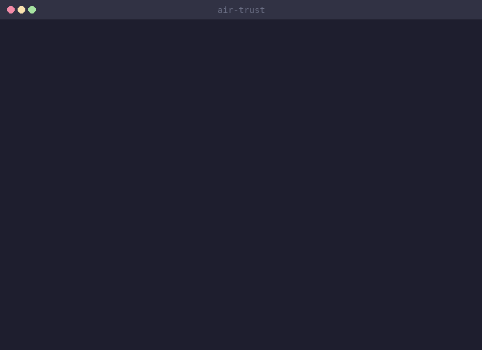

# air-trust

Tamper-evident audit chain for AI agents.

[](https://pypi.org/project/air-trust/)
[](https://pypi.org/project/air-trust/)
[](air-trust/tests/)
[](LICENSE)

<p align="center">
  
</p>

## Highlights

- One line to start recording: `client = air_trust.trust(OpenAI())`
- HMAC-SHA256 chained signatures — if anyone modifies a record, the chain breaks
- Ed25519 signed handoffs — cryptographic proof of which agent handed off to which
- 25+ frameworks auto-detected — OpenAI, LangChain, CrewAI, Anthropic, Google ADK, and more
- Attestation Pool — publish ML-DSA-65 signed compliance proofs to a public registry
- Zero dependencies — pure Python, no cloud, no API keys, runs on your machine
- 305 tests covering integrity, completeness, handoffs, and edge cases

## Install

```bash
pip install air-trust
```

That's it. No config, no API keys, no Docker.

## Quick Start

```python
import air_trust
from openai import OpenAI

# Wrap any AI client — every call is now HMAC-SHA256 audited
client = air_trust.trust(OpenAI())

response = client.chat.completions.create(
    model="gpt-4o",
    messages=[{"role": "user", "content": "Hello"}]
)

# Verify the chain anytime
result = air_trust.verify()
# {'valid': True, 'records': 42, 'broken_at': None}
```

Or from the CLI:

```bash
python3 -m air_trust verify
# INTEGRITY     PASS  42 events, 42 valid HMAC links
# COMPLETENESS  PASS  3 sessions complete, no gaps
```

## What It Proves

air-trust gives you three layers of cryptographic proof. Each is backward-compatible — you can start with v1.0 and add layers as you need them.

| Layer | What It Proves | How |
|---|---|---|
| Integrity (v1.0) | No record was changed after it was written | HMAC-SHA256 chained signatures |
| Completeness (v1.1) | No record was silently dropped | Monotonic sequence numbers + gap detection |
| Handoff provenance (v1.2) | Agent A handed data to Agent B, and B acknowledged it | Ed25519 asymmetric signatures |

## Framework Auto-Detection

Pass anything to `air_trust.trust()` and it figures out the rest:

```python
client = air_trust.trust(OpenAI())         # Proxy adapter
crew = air_trust.trust(my_crew)            # CrewAI decorator adapter
handler = air_trust.trust(my_chain)        # LangChain callback adapter
```

| Adapter | Frameworks |
|---|---|
| Proxy | OpenAI, Anthropic, Google GenAI, Ollama, vLLM, LiteLLM, Together, Groq, Mistral, Cohere |
| Callback | LangChain, LangGraph, LlamaIndex, Haystack |
| Decorator | CrewAI, Smolagents, PydanticAI, DSPy, AutoGen, Browser Use |
| OpenTelemetry | Semantic Kernel, any OTel-instrumented system |
| MCP | Claude Desktop, Cursor, Claude Code, Windsurf |

## Signed Handoffs

When agents pass work to other agents, signed handoffs create cryptographic proof of who sent what to whom. Three record types — handoff_request, handoff_ack, handoff_result — each signed with the sending agent's Ed25519 private key.

```bash
pip install "air-trust[handoffs]"
python3 -m air_trust keygen --agent research-bot
python3 -m air_trust keygen --agent writer-bot
```

```python
# Agent A requests handoff — auto-signed with Ed25519
chain.write(Event(
    type="handoff_request",
    identity=identity_a,
    interaction_id="task-001",
    counterparty_id=identity_b.fingerprint,
    payload_hash=compute_payload_hash("Summarize this document"),
    nonce=generate_nonce(),
))
```

```bash
python3 -m air_trust verify
# HANDOFFS      PASS  1 interaction verified
#   request   PASS  Ed25519 OK (research-bot)
#   ack       PASS  Ed25519 OK (writer-bot)
#   result    PASS  Ed25519 OK (writer-bot)
#   payload   PASS  SHA-256 hash match
```

Tamper with the payload? The verifier catches it immediately.

[Try the interactive demo →](https://airblackbox.ai/demo/signed-handoff)

## Compliance Oracle & Attestation Pool

Publish cryptographically signed compliance proofs to a public registry. Three-party trust: your team signs with ML-DSA-65, the registry stores it, anyone can verify independently.

```bash
# Scan, sign, and publish in one command
air-blackbox attest create --publish --name "My AI System"

# Output:
# Published! Registry accepted the attestation.
#   Verify: https://airblackbox.ai/verify/air-att-2026-04-12-a7f3c2e1
#   Badge:  https://airblackbox.ai/badge/air-att-2026-04-12-a7f3c2e1
```

```bash
# Or publish an existing local attestation
air-blackbox attest publish --id air-att-2026-04-12-a7f3c2e1
```

Embeddable badge for your README:

```markdown
[](https://airblackbox.ai/verify/air-att-2026-04-12-a7f3c2e1)
```

No source code is stored. Only signed proofs — system hash, check counts, framework list, scanner version, and the ML-DSA-65 signature.

[Learn more about the Attestation Pool →](https://airblackbox.ai/attest)

## How It Works

Every event is signed and chained to the previous one:

```
HMAC(key, previous_hash_bytes || JSON(record, sort_keys=True))
```

Modify any record → the chain breaks. Delete a record → the next hash won't match. Reorder records → sequence breaks. Replay an old record → session numbers catch it.

Everything is stored locally in SQLite at `~/.air-trust/events.db`. The signing key auto-generates at `~/.air-trust/signing.key`. No cloud, no network calls.

## Who Made This

Built by [Jason Shotwell](mailto:jason@airblackbox.ai) as the cryptographic backbone of [AIR Blackbox](https://airblackbox.ai) — open-source EU AI Act compliance tooling for developers.

EU AI Act Article 12 requires high-risk AI systems to maintain logs "sufficient to ensure traceability." air-trust provides exactly that: tamper-evident proof of what happened, stored on your infrastructure.

Enforcement deadline: August 2, 2026.

## Learn More

- [Interactive demo](https://airblackbox.ai/demo/signed-handoff) — see signed handoffs in action (no install needed)
- [Spec v1.2](air-trust/SPEC.md) — the full protocol specification
- [Changelog](air-trust/CHANGELOG.md) — what shipped in each version
- [airblackbox.ai](https://airblackbox.ai) — the project homepage
- [PyPI](https://pypi.org/project/air-trust/) — package page

## License

Apache-2.0. See [LICENSE](LICENSE).

---

If this helps you prepare for EU AI Act enforcement, [star the repo](https://github.com/airblackbox/air-trust) — it helps other teams find it.
